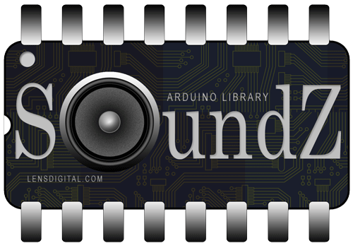

# SoundZ

SoundZ is an audio library for playing back uncompressed WAV files from SPI Flash with Arudino.
It's based on WaveHC library by Adafruit (and William Greiman) and modified by me to read files
from SPI Flash instead of SD card. 

Requires SerialFlash library: https://github.com/PaulStoffregen/SerialFlash

##Hardware:
Currently library has been only tested with custom ATMega1284p running "maniacbug" bootloader.

SPI Flash memory that confirmed working is: S25FL127SABMFI101, but all ICs that compatible with SerialFlash library should work in theory.

As far as Audio Hadrdware, it's based on Adafruit's WaveShield (https://learn.adafruit.com/adafruit-wave-shield-audio-shield-for-arduino). As bare minimum it requires MCP4921 DAC. TS922IN OpAmp is used to amplify sound for playback via headphones or small speaker (i.e. 1/2W).

##List of known issues:
- Pause/Resume not tested, might not work
- Seek function (to skip portion of WAV) is definately not working (not ported yet). 

	
